# Intelligent Edge 기술 실습 자료

이전 과정에서 Azure Edge Runtime 을 가상머신에 설치하고 Transparent Gateway 로 설정하여 IoT 디바이스를 연결/메세지 관리. Visual Studio 를 통해 모듈을 배포하는 실습을 완료했습니다.

Visual Studio Code (VS Code)는 개발자의 개발 속도를 향상시키는 파워풀한 크로스플랫폼 무료 개발환경입니다. 이번 과정을 통해 아래 내용을 학습할 수 있습니다.

## 학습목표
- VS Code 의 Azure IoT Tool extention 을 통해 Azure IoT Hub 에 IoT 디바이스를 추가하고 온/습도 코드 자동 생성
- 생성된 IoT 디바이스 코드로 바로 IoT Hub 에 연결
- Azure Edge 를 통해 IoT Hub 에 연결
- Azure IoT Explorer 를 통해 두 경우 Telemetry 정보 확인
- Azure IoT Hub에서 메세지 라우팅 및 Azure Logic 을 통해 알람/메일 전송

# 사전준비 내용

- [Visual Studio Code](https://code.visualstudio.com/)
- [VS code 용 Azure IoT Tools](https://marketplace.visualstudio.com/items?itemName=vsciot-vscode.azure-iot-tools)
- [Azure IoT Explorer](https://github.com/Azure/azure-iot-explorer/releases)

# 실습 #1 - VS Code
1. VS Code 왼쪽 아래의 탐색기에서 `AZURE IOT HUB`를 클릭합니다.

    

2. `Set IoT Hub Connection String`을 클릭합니다.

    

3. 입력 창이 뜨면 IoT Hub의 Connection String 을 입력합니다. (처음 한 번만 입력하면 됩니다) 
형태는 아래와 같습니다.

    > HostName=`<my-hub>`.azure-devices.net;SharedAccessKeyName=`<my-policy>`;
SharedAccessKey=`<my-policy-key>`

    

    > **`IoT Hub Connection String`** 을 입력해야 합니다. Device Connection String 을 입력하지 않도록 주의합니다.

4. 해당 Azure IoT Hub 의 디바이스 리스트가 나타납니다.

    

5. `...` 아이콘 More Actions 을 클릭하여 `Create Device` 를 선택하고 DeviceID 이름을 정합니다.

    
    

6. 디바이스가 추가되고 OUTPUT 창을 통해 생성된 Device 의 상세속성을 확인할 수 있습니다.

    
    

7. 생성된 디바이스에 우클릭하여 `Generate Code`를 선택합니다.

    

8. 입력 창에 선호하는 언어를 선택할 수 있습니다. 
    > 여기서는 `C#` 을 선택합니다.

    
   
9. 입력 창이 뜨면 `Send device-to-cloud message` 선택

    

10. 적당한 폴더를 생성하여 선택하면 코드가 생성되어 나타납니다.

    

11. `Device Connection String` 이 자동으로 입력된 것을 볼 수 있습니다.

    

12. F5 를 눌러 코드를 실행하면 IoT Hub 에 연결되어 온/습도 값을 전송합니다.

    

# 실습 #2 - 메세지 모니터링 및 Azure Edge 를 통한 연결

1. Device to Cloud(`D2C`) 메세지는 아래의 방법들로 확인이 가능합니다.
    - Device Explorer
    - Visual Studio 의 Cloud Explorer
    - [VS Code 용 Azure IoT Tools](https://marketplace.visualstudio.com/items?itemName=vsciot-vscode.azure-iot-tools)
    - [Azure IoT Explorer](https://github.com/Azure/azure-iot-explorer/releases)
    
    > 여기서는 주로 Azure IoT Explorer 를 사용합니다.

2. Azure IoT Explorer 를 실행하고 IoT Hub connection string 를 입력합니다.

    
    > 한 번 입력해두면 다수의 IoT Hub가 있을 시 선택하여 사용하기 편합니다.

3. IoT Hub 에 추가된 Device 리스트가 나타납니다.

    

4. 내가 추가한 디바이스를 선택하여 `Telemetry` 탭으로 이동합니다.

    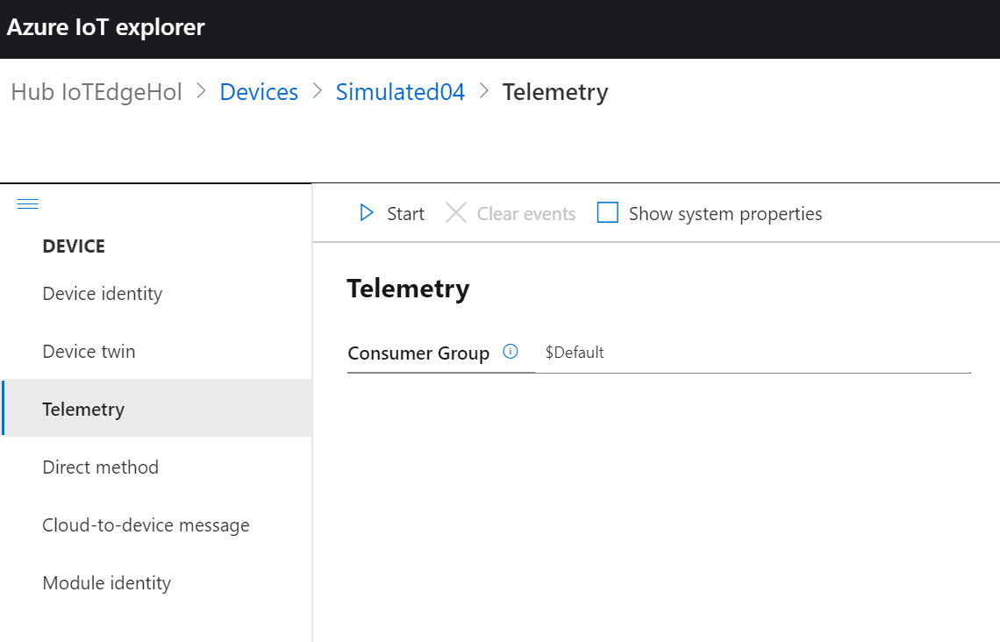

5. `Start` 를 클릭하면 모니터링을 시작하고 해당 디바이스의 온/습도 값이 전송되는 것을 확인할 수 있습니다.

    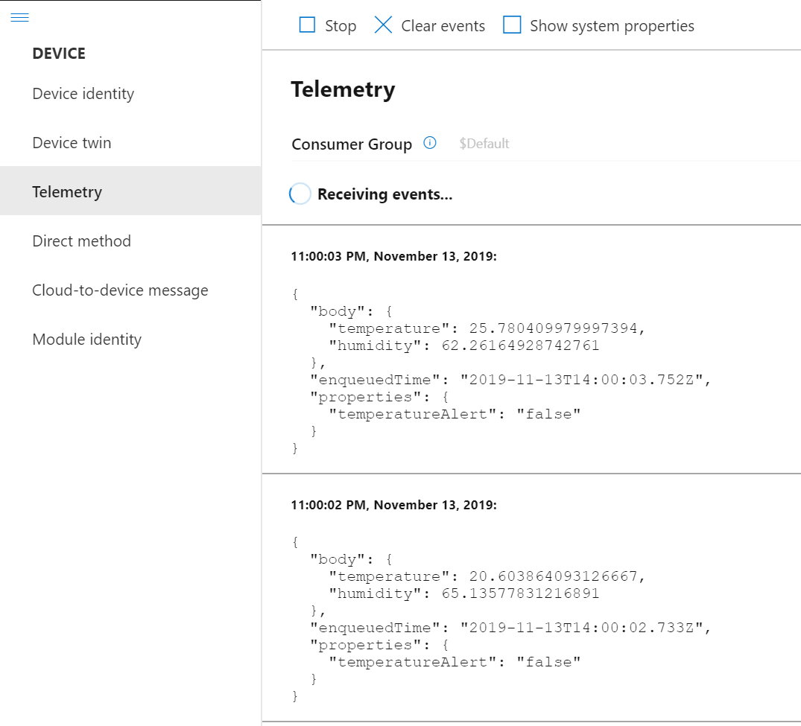

    > 모니터링 외에도 Device twin 확인 / Direct Method 호출 / C2D 메세지 전송 등 다양한 기능을 사용할 수 있습니다.

6. 이제는 Azure Edge 를 통해 Azure IoT Hub로 연결해보겠습니다.
    이를 위해 생성된 IoT Device 를 Azure Portal 에서 Parent Device를 지정해줍니다.

    > 포탈에서 IoT Hub -> IoT Devices -> 생성한 디바이스 클릭

    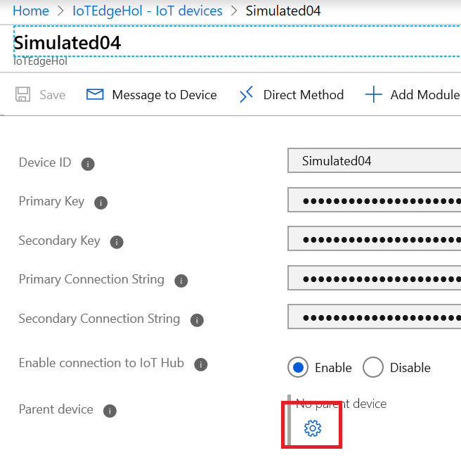

7. `Parent Device` 를 전에 생성한 Edge 로 지정해줍니다.

    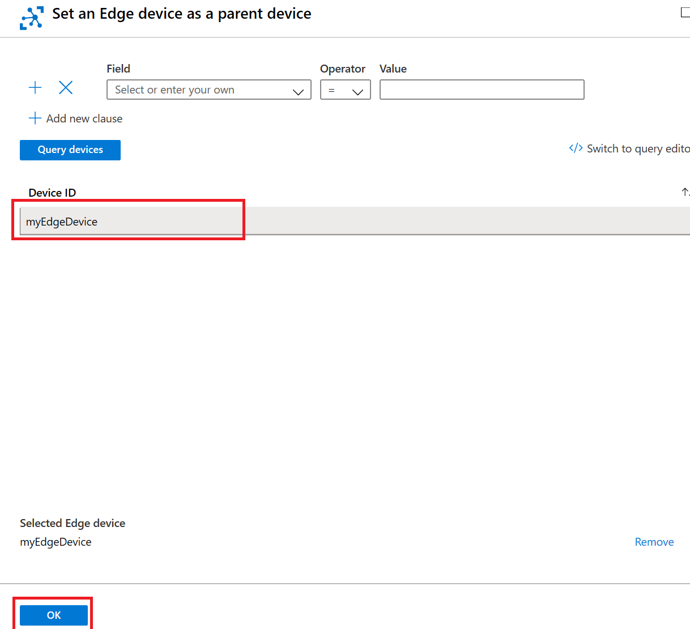

8. 이제 코드로 돌아가서 Shift+F5 로 정지하고 `Device Connection String`을 변경해줍니다.

    > 기존 뒤에 `;GatewayHostName=[이전세션에 사용한 것]` 를 추가해줍니다.

    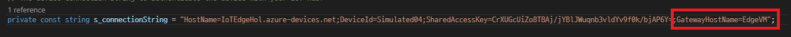

9. 다시 F5 를 눌러 코드를 실행하면 Edge Device 를 통해 IoT Hub 로 메세지가 들어오고 30도 이상의 온도는 "temperatureAlert" : "true" 메세지가 추가되는 것을 볼 수 있습니다.

    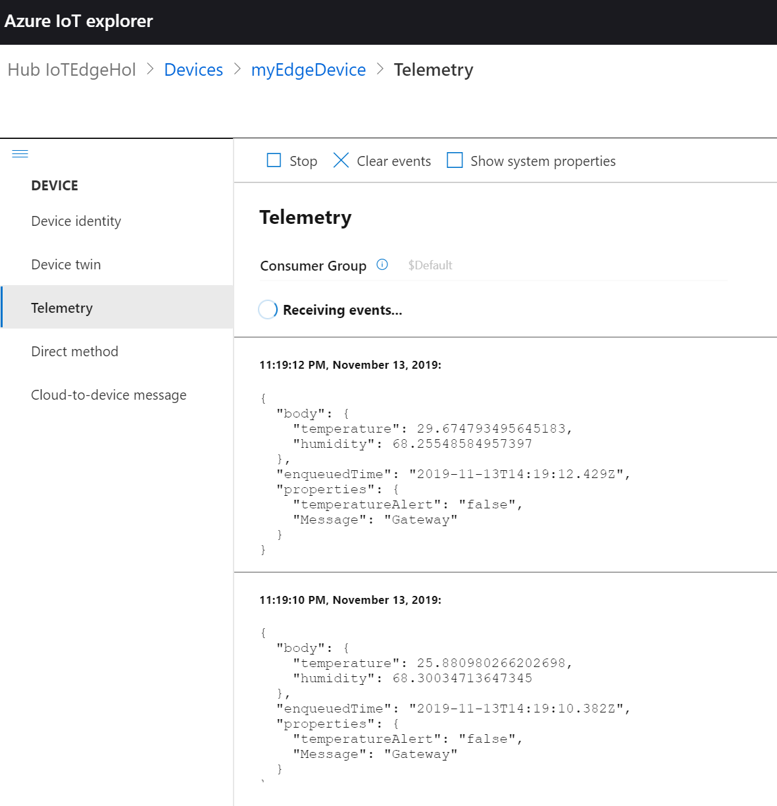

10. 이제 Edge Device 에 IoT Device 를 연결하고 메세지 처리하는 몇 가지 방법을 학습했습니다. 더 많은 디바이스를 추가하여 다양한 값을 처리해봅니다.

# 실습 #3 메세지 라우팅과 Azure Logic App 서비스를 이용한 알림/메일 전송

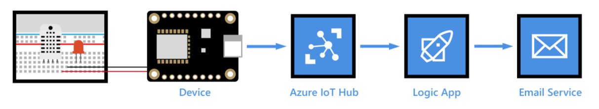

[Azure Logic Apps](https://docs.microsoft.com/azure/logic-apps/) 를 통해 온-프레미스 및 클라우드 서비스, 하나 이상의 엔터프라이즈, 다양 한 프로토콜에서 워크플로를 오케스트레이션 할 수 있습니다. Logic App은 트리거로 시작 하고 그 다음에는 조건 및 반복기와 같은 기본 제공 컨트롤을 사용 하여 시퀀싱 할 수 있는 하나 이상의 작업이 있습니다. 이러한 유연성을 통해 IoT 모니터링 시나리오를 위한 이상적인 IoT 솔루션을 만들 수 있습니다. 예를 들어 IoT Hub End point의 장치에서 원격 분석 데이터에 따라 경고 메일을 보내고, 장치에서 오류를 보고 하는 경우 기술 지원 담당자에게 긴급 경고를 보낼 수 있습니다.

본 과정에서는 IoT Hub와 메일박스를 연결하여 온도를 모니터링하고 알림을 보내는 Logic App을 만드는 방법을 배울 수 있습니다.

## 학습내용
- Service Bus 네임 스페이스를 만들고 여기에 Service Bus 큐를 추가 합니다.
- 온도 경고가 포함된 메시지를 Service Bus 큐로 라우팅하도록 IoT Hub에 Custom Endpoint 및 라우팅 규칙을 추가 합니다.
- Service Bus 큐에서 메시지를 사용도록 구성하고 알림 이메일을 보내는 논리 앱을 만들어 테스트 합니다.

### Service Bus 네임스페이스 만들기

1. Azure Portal에서 **+ Create a resource** > **Integration** > **Service Bus**를 선택 합니다.

2. **Create namespace** 창에서 다음 정보를 제공 합니다.

    **Name**: Service bus 네임 스페이스의 이름입니다.

    **Pricing tier**: 목록에서 Basic 을 선택 합니다.

    **Resource group**: IoT Hub에서 사용하는 것과 동일한 리소스 그룹을 사용합니다.

    **Location**: IoT hub에서 사용 하는 것과 동일한 위치를 사용 합니다.

    

3. **Create**를 선택합니다. 다음 단계로 이동 하기 전에 배포가 완료 될 때까지 기다립니다.

### Name Space에 Service Bus queue 추가

1. Service Bus 네임 스페이스를 엽니다. Service Bus 네임 스페이스를 가져오는 가장 쉬운 방법은 리소스 창에서 **리소스 그룹**을 선택하고 리소스 그룹을 선택한 다음 리소스 목록에서 Service Bus 네임 스페이스를 선택 하는 것입니다.

2. Service Bus 네임 스페이스 창에서 **+ Queue**를 선택 합니다.

3. 큐의 이름을 입력 한 다음 만들기를 선택 합니다. 큐가 성공적으로 만들어지면 큐 만들기 창이 닫힙니다.

    

4. Service Bus 네임 스페이스 창으로 돌아가서 엔터티아래에서 큐를 선택 합니다. 목록에서 Service Bus 큐를 열고 공유 액세스 정책 > + 추가를 선택 합니다.

5. 정책의 이름을 입력 하 고 관리를 선택한 다음 만들기를 선택 합니다.

    

### IoT Hub에 Custom endpoint 및 라우팅 추가

1. IoT Hub를 엽니다. IoT Hub를 가져오는 가장 쉬운 방법은 리소스 창에서 리소스 그룹을 선택하고 리소스 그룹을 선택한 다음 리소스 목록에서 IoT Hub를 선택 하는 것입니다.

2. Messaging에서 메시지 라우팅을 선택 합니다. 메시지 라우팅 창에서 Custom endpoints 탭을 선택 하고 **+ Add**를 선택 합니다. 드롭다운 목록에서 Service bus queue를 선택 합니다.

    

3. Service bus endpoint 추가 창에서 다음 정보를 입력 합니다.

    Endpoint name: 엔드포인트의 이름입니다.

    Service Bus 네임스페이스: 만든 네임 스페이스를 선택 합니다.

    Service bus queue: 만든 큐를 선택합니다.

    

### 쿼리 추가

1. Message routing 창으로 돌아가서 경로 탭을 선택한 다음 + 추가를 선택 합니다.

2. 경로 추가 창에서 다음 정보를 입력 합니다.

    Name: 라우팅 규칙의 이름입니다.

    Endpoint: 만든 endpoint을 선택 합니다.

    Data source: Device Telemetry Messages를 선택 합니다.

    Routing query: temperatureAlert = "true" 을 입력합니다.

    

### Logic app 만들기 및 구성

이전 섹션에서는 온도 경고가 포함 된 메시지를 Service Bus 큐로 라우팅하도록 IoT hub를 설정했습니다. 이제 Service Bus 큐를 모니터링 하고 메시지가 큐에 추가될 때마다 이메일 알림을 보내는 Logic app을 설정 합니다.

1. Create a resource > Integration > Logic App을 선택합니다.

2. 다음 정보를 입력합니다.

    Name: Logic App의 이름입니다.
    Resource group: IoT Hub에서 사용하는 것과 동일한 리소스 그룹을 사용합니다.
    Location: IoT Hub와 동일한 위치를 사용합니다.

    

### Logic App trigger 구성

1. Logic App 을 열고 Logic Apps 디자이너에서 템플릿으로 스크롤하고 Blank Logic App을 선택합니다.

    

2. All 탭을 선택 하 고 Service Bus를 선택 합니다.

    

3. Trigger에서 큐에 하나 이상의 메시지가 도착하는 경우(auto-complete)를 선택 합니다.

    

4. Service Bus 연결을 만듭니다.

    연결 이름을 입력 하 고 목록에서 Service Bus 네임 스페이스를 선택 합니다. 다음 화면이 열립니다.

    

    Service bus 정책 (RootManageSharedAccessKey)을 선택 합니다.

    

    마지막 화면에서 Queue name에 드롭다운에서 만든 큐를 선택합니다. Maximun message count 는 175를 입력합니다.

    

    Logic Apps 디자이너의 맨 위에 있는 메뉴에서 Save 을 눌러 변경 내용을 저장 합니다.

### Logic App 작업 구성

1. 새 단계를 선택합니다. 작업 선택에서 All 탭을 선택 합니다.

    아래 그림처럼 단계별로 추가를 해줍니다.

    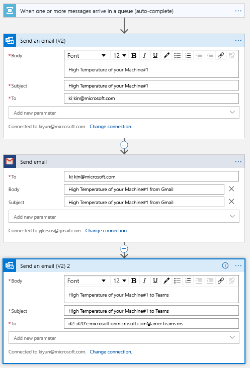

    첫 번재는 outlook 을 통한 이메일 발송

    두 번째는 Gmail 을 통한 이메일 발송

    세 번째는 outlook 을 통해 Teams 그룹에 메세지 발송입니다.

    선호에 따라 생략해도 무방합니다.

2. 메세지 라우팅을 추가했기 때문에 이제 디바이스에서 온도가 30도가 넘는 경우는 Azure IoT Explorer 의 $Default Consumer group 에서는 메세지가 라우팅되지 않습니다.

    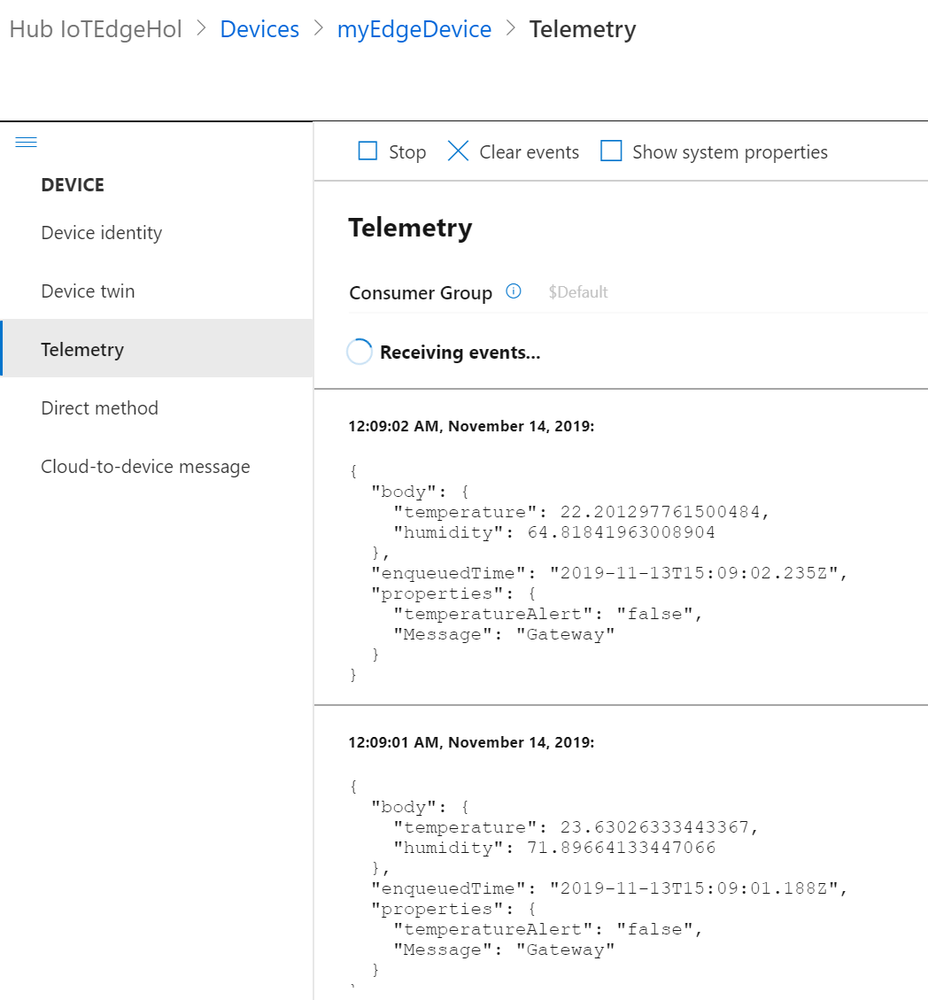

    하지만 Edge Device 의 우리가 배포했던 모듈의 로그에는 잘 들어오고 있습니다.

    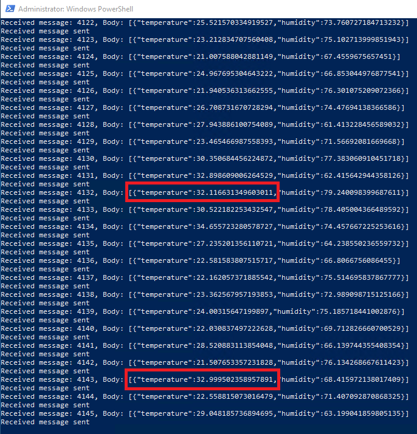

3. 그리고, 온도가 30도가 넘는 경우는 작업으로 설정한 이메일과 Teams 메세지가 잘 들어오고 있습니다.

    
    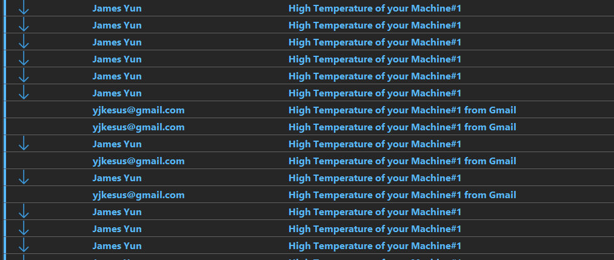    

    > outlook & Gmail 발송

    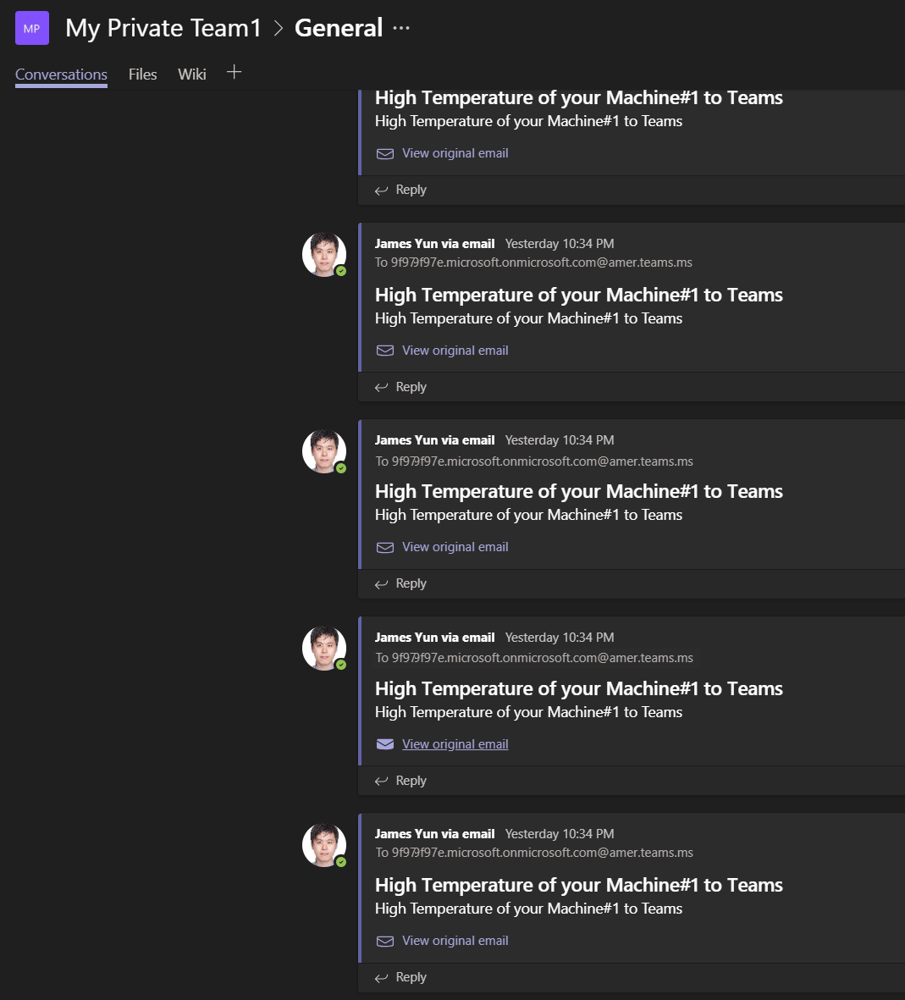

    > Teams 메세지

4. 이제 더 많은 디바이스를 추가하고 더 많은 조건의 라우팅을 만들어서 Logic app과 다양한 기능을 연동할 수 있습니다.

## 추가로 다루고 싶었던 내용들

- IoT Plug and Play and Azure IoT Central
    1. [Azure IoT Plug and Play](https://github.com/Azure/IoTPlugandPlay)
    2. `IoT Device Code generation from Plug and Play with VS Code`
    3. [IoT Plug and Play certified devices](https://catalog.azureiotsolutions.com/alldevices?filters={%2220%22:[%221%22]})
        - Example#1 - [SHARP Windows Collaboration Display](https://catalog.azureiotsolutions.com/details?title=Windows-Collaboration-Display-PN_CD701&source=all-devices-page)
        - Example#2 - [Vibration monitoring solution](https://catalog.azureiotsolutions.com/details?title=Equipment-Vibration-Monitoring-Solution&source=all-devices-page&deviceId=d658b5f0-d2e3-467d-ae00-39a8dabee4f9)
    4. [Azure IoT Central + Azure IoT Plug and Play](http://www.azureiotcentral.com/)

    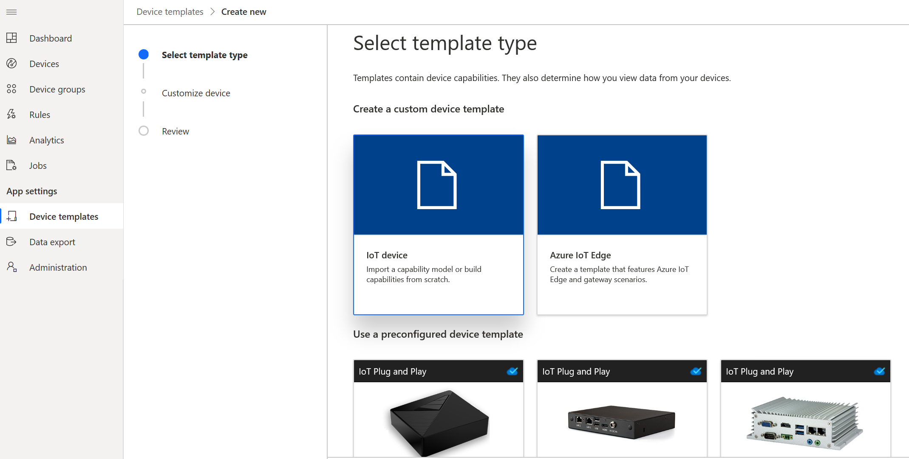
    

- Azure IoT Plug and Play Bridge
    1. [Azure IoT Plug and Play bridge](https://github.com/Azure/AzurePnPBridgePreview)

    

