# Intelligent Edge 기술 실습 자료

이전 과정에서 Azure Edge Runtime 을 VM 에 설치하고 Transparent Gateway 로 설정하여 IoT Device 를 연결/메세지 관리. Visual Studio 를 통해 모듈을 배포하는 실습을 완료했습니다.

Visual Studio Code (VS Code)는 개발자의 개발 속도를 향상시키는 파워풀한 크로스플랫폼 무료 개발환경입니다. 이번 과정을 통해 아래 내용을 학습할 수 있습니다.
- Azure IoT Tool 을 통해 Azure IoT Hub 에 IoT 디바이스를 추가하고 온/습도 코드 자동 생성

## 학습목표
- 생성된 IoT 디바이스 코드로 바로 IoT Hub 에 연결
- Azure Edge 를 통해 IoT Hub 에 연결
- Azure IoT Explorer 를 통해 두 경우 Telemetry 정보 확인
- Azure IoT Hub에서 메세지 라우팅 및 Azure Logic 을 통해 알람/메일 전송

# 사전준비 내용

- [Visual Studio Code](https://code.visualstudio.com/)
- [VS code 용 Azure IoT Tools](https://marketplace.visualstudio.com/items?itemName=vsciot-vscode.azure-iot-tools)
- [Azure IoT Explorer](https://github.com/Azure/azure-iot-explorer/releases)

# 실습 #1 - VS Code
1. VS Code 왼쪽 아래의 탐색기에서 `AZURE IOT HUB`를 클릭합니다.
    

2. `Set IoT Hub Connection String`을 클릭합니다.
    

3. 입력 창이 뜨면 IoT Hub의 Connection String 을 입력합니다. (처음 한 번만 입력하면 됩니다) 
형태는 아래와 같습니다.

    > HostName=`<my-hub>`.azure-devices.net;SharedAccessKeyName=`<my-policy>`;
SharedAccessKey=`<my-policy-key>`

    

    > **`IoT Hub Connection String`** 을 입력해야 합니다. Device Connection String 을 입력하지 않도록 주의합니다.

4. 해당 Azure IoT Hub 의 디바이스 리스트가 나타납니다.
    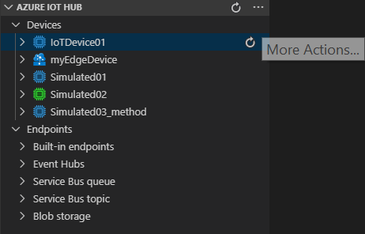

5. `...` 아이콘 More Actions 을 클릭하여 `Create Device` 를 선택하고 DeviceID 이름을 정합니다.
    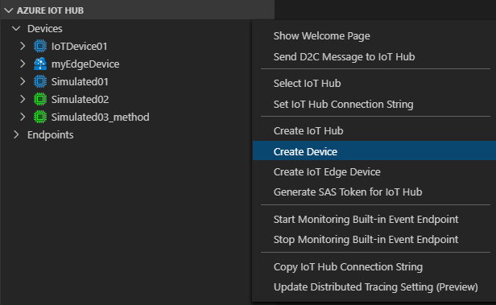
    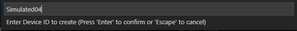

6. 디바이스가 추가되고 OUTPUT 창을 통해 생성된 Device 의 상세속성을 확인할 수 있습니다.
    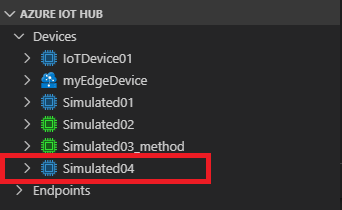
    

7. 생성된 디바이스에 우클릭하여 `Generate Code`를 선택합니다.
    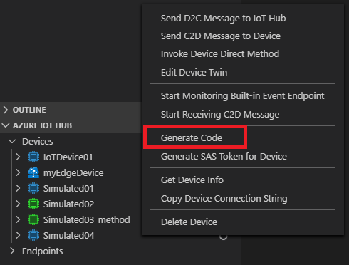

8. 입력 창에 선호하는 언어를 선택할 수 있습니다. 
    > 여기서는 `C#` 을 선택합니다.
    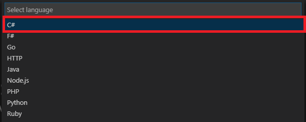
   
9. 입력 창이 뜨면 `Send device-to-cloud message` 선택
    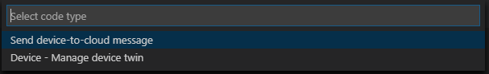

10. 적당한 폴더를 생성하여 선택하면 코드가 생성되어 나타납니다.
    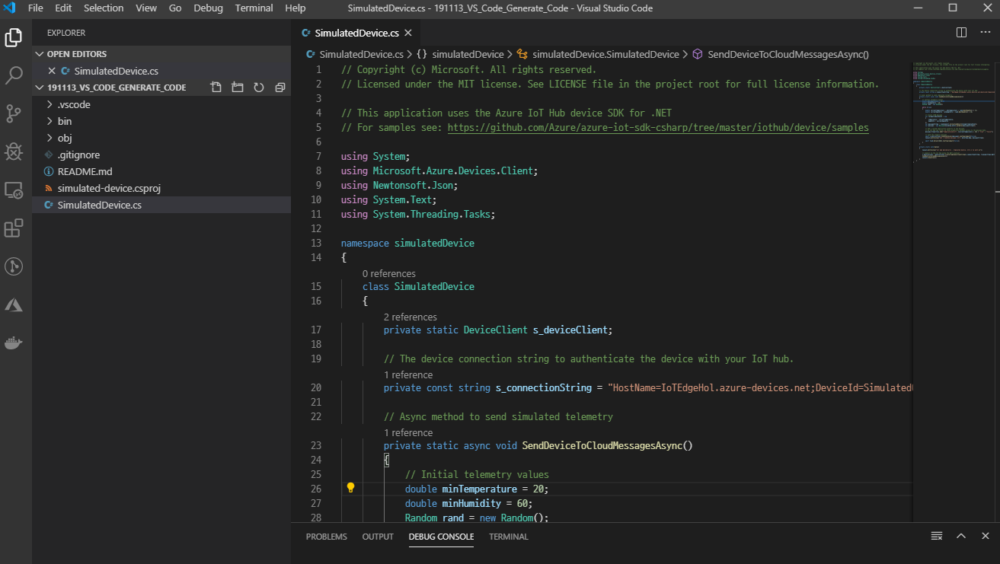

11. `Device Connection String` 이 자동으로 입력된 것을 볼 수 있습니다.
    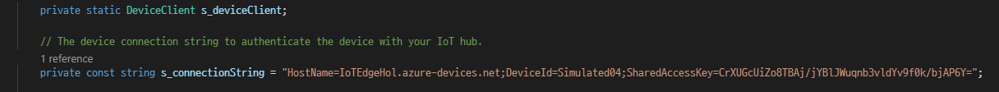

12. F5 를 눌러 코드를 실행하면 IoT Hub 에 연결되어 온/습도 값을 전송합니다.
    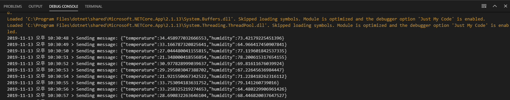

# 실습 #2 - 메세지 모니터링 및 Azure Edge 를 통한 연결

1. Device to Cloud(`D2C`) 메세지는 아래의 방법들로 확인이 가능합니다.
    - Device Explorer
    - Visual Studio 의 Cloud Explorer
    - [VS Code 용 Azure IoT Tools](https://marketplace.visualstudio.com/items?itemName=vsciot-vscode.azure-iot-tools)
    - [Azure IoT Explorer](https://github.com/Azure/azure-iot-explorer/releases)
    > 여기서는 주로 Azure IoT Explorer 를 사용합니다.

2. Azure IoT Explorer 를 실행하고 IoT Hub connection string 를 입력합니다.
    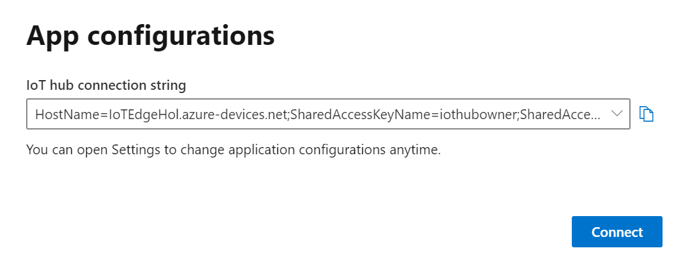
    > 다수의 IoT Hub가 있을 시 선택하여 사용하기 편합니다.

3. IoT Hub 에 추가된 Device 리스트가 나타납니다.
    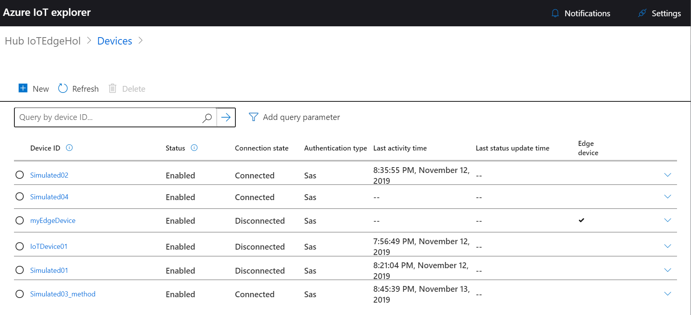

4. 

- [Lab-1 LED Blink](Lab-1.md) 
- [Lab-2 IoT Hub Connection / Uplink Scenario](Lab-2.md)
- [Lab-3 IoT Central Connection](Lab-3.md)
- [Lab-4 Visualize real world data on Azure IoT Central](Lab-4.md)
- [Lab-5 Application Over-the-Air deployment](Lab-5.md)
